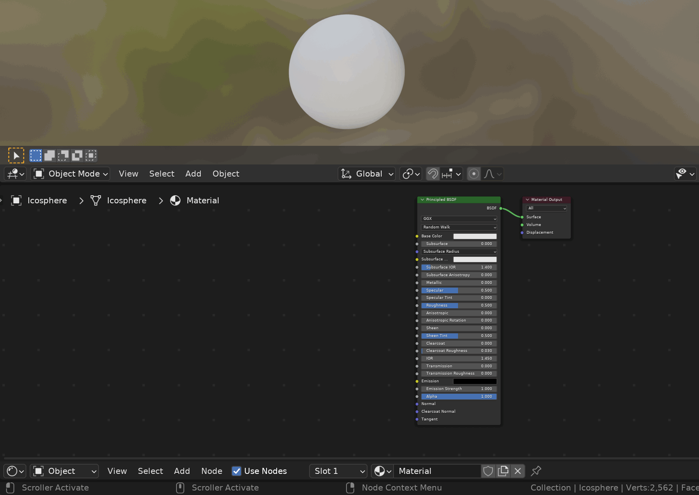

# TexToShader
**Blender Add-ons.**
Importing textures one by one, setting color space, and connecting corresponding nodes can be tedious. This Add-ons simplifies these steps by automatically importing and setting some common textures.

## Use
1. Select the material node in shader editor.
2. `shader editor` > `add` > `shader` > `Tex->Shader`.
3. Select your texture files, enter.

## Setting
* **Node X/Y Gap:** The horizontal/vertical distance between nodes.
* **Texture Keywords:** Corresponding textures imported according to keywords.
